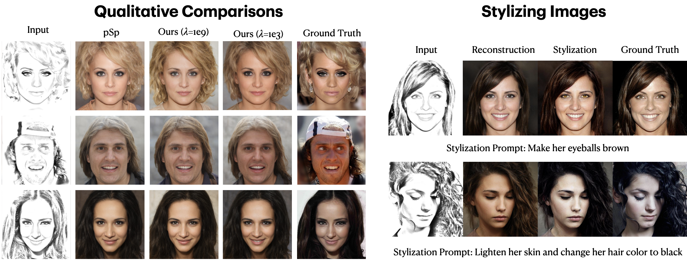

# CriminalCanvas: From Sketch to Solution in Stylized Montages

<a href="https://colab.research.google.com/drive/1Qep2fBYkCuXvMlIib25FHlMvZ-VhmRAB?usp=sharing"></a>  

> Given a sketch from the montage artist, we aim to reconstruct and stylize a montage of a criminal which highly resembles their appearance.

## Description   
For the first stage, we utilize a method named pSp, which extracts feature maps from a pyramid network and inputs them into a pretrained StyleGAN generator trained on human face datasets such as CelebA-HQ to reconstruct images from a given sketch.  
The second stage stylizes the output with instructions (e.g. "brown hair and blue eyes") using InstructPix2Pix. Finally, we improve the existing pSp framework by adding our own loss function and also evaluate the method on real sketch drawings.

## Table of Contents
  * [Description](#description)
  * [Table of Contents](#table-of-contents)
  * [Application](#application)
    + [Sketch to Face](#sketch-to-face)
  * [Getting Started](#getting-started)
    + [Prerequisites](#prerequisites)
    + [Installation](#installation)
    + [Inference Notebook](#inference-notebook)
    + [Pretrained Models](#pretrained-models)
  * [Training](#training)
    + [Preparing your Data](#preparing-your-data)
    + [Training pSp](#training-psp)
    + [Additional Notes](#additional-notes)
  * [Testing](#testing)
    + [Inference](#inference)
    + [Multi-Modal Synthesis with Style-Mixing](#multi-modal-synthesis-with-style-mixing)
    + [Computing Metrics](#computing-metrics)
  * [Repository structure](#repository-structure)
  * [TODOs](#todos)
  * [Credits](#credits)

## Application

### Sketch to Face
Here we wish to generate photo-realistic face images from ambiguous sketch images. Using style-mixing, we inherently support multi-modal synthesis for a single input.
<p align="center">

</p>

## Getting Started
### Prerequisites
- We recommend run the scripts on Linux (HPC,  e.g. UM GreatLakes)
- NVIDIA GPU with a large GPU memory (e.g. NVIDIA A40)
- Python + CUDA version supporting the GPU

### Installation
- Clone this repo:
```
git clone https://github.com/inbumpark/VisionDetectives
cd VisionDectectives
```

- Dependencies:  
We recommend running this repository using [Anaconda](https://docs.anaconda.com/anaconda/install/). 
All dependencies for defining the environment are provided in `environment/psp_env.yaml`.
You might need to update dependencies to fit you hardware.
```
conda env create -f environment/psp_env.yml
conda activate psp_env
```
```
module load gcc
module load cuda
```

### Inference Notebook
To help visualize the pSp framework on multiple tasks and to help you get started, we provide a Jupyter notebook in the top that allows one to visualize the various applications of pSp. 

The notebook will download the necessary pretrained models and run inference on the images found in `notebooks/images`.  
The notebook also demonstrates pSp's ability to perform multi-modal synthesis using style-mixing. 

### Pretrained Models
Please download the pre-trained models from the following links. Each pSp model contains the entire pSp architecture, including the encoder and decoder weights.
| Path | Description
| :--- | :----------
|[Sketch to Image (Original PSP)](https://drive.google.com/file/d/1lB7wk7MwtdxL-LL4Z_T76DuCfk00aSXA/view?usp=sharing)  | pSp trained with the CelebA-HQ dataset for image synthesis from sketches.
|[Sketch to Image (Lambda attention 1e3)](https://drive.google.com/file/d/1YS4IsZrZkxSVMsuL96NTAORitAg-EMuy/view?usp=sharing)  | pSp trained with the CelebA-HQ dataset for image synthesis from sketches.
|[Sketch to Image (Lambda attention 1e9)](https://drive.google.com/file/d/1lB7wk7MwtdxL-LL4Z_T76DuCfk00aSXA/view?usp=sharing)  | pSp trained with the CelebA-HQ dataset for image synthesis from sketches.

**Add our models in (original and 1e9)!**

If you wish to use one of the pretrained models for training or inference, you may do so using the flag `--checkpoint_path`.

In addition, we provide various auxiliary models needed for training your own pSp model from scratch as well as pretrained models needed for computing the ID metrics reported in the paper.
| Path | Description
| :--- | :----------
|[FFHQ StyleGAN](https://drive.google.com/file/d/1EM87UquaoQmk17Q8d5kYIAHqu0dkYqdT/view?usp=sharing) | StyleGAN model pretrained on FFHQ taken from [rosinality](https://github.com/rosinality/stylegan2-pytorch) with 1024x1024 output resolution.
|[IR-SE50 Model](https://drive.google.com/file/d/1KW7bjndL3QG3sxBbZxreGHigcCCpsDgn/view?usp=sharing) | Pretrained IR-SE50 model taken from [TreB1eN](https://github.com/TreB1eN/InsightFace_Pytorch) for use in our ID loss during pSp training.
|[MoCo ResNet-50](https://drive.google.com/file/d/18rLcNGdteX5LwT7sv_F7HWr12HpVEzVe/view?usp=sharing)  | Pretrained ResNet-50 model trained using MOCOv2 for computing MoCo-based similarity loss on non-facial domains. The model is taken from the [official implementation](https://github.com/facebookresearch/moco).
|[CurricularFace Backbone](https://drive.google.com/file/d/1f4IwVa2-Bn9vWLwB-bUwm53U_MlvinAj/view?usp=sharing)  | Pretrained CurricularFace model taken from [HuangYG123](https://github.com/HuangYG123/CurricularFace) for use in ID similarity metric computation.
|[MTCNN](https://drive.google.com/file/d/1tJ7ih-wbCO6zc3JhI_1ZGjmwXKKaPlja/view?usp=sharing)  | Weights for MTCNN model taken from [TreB1eN](https://github.com/TreB1eN/InsightFace_Pytorch) for use in ID similarity metric computation. (Unpack the tar.gz to extract the 3 model weights.)

**Add the attention model in!**

**And remove unnencessary models!**

By default, we assume that all auxiliary models are downloaded and saved to the directory `pretrained_models`. However, you may use your own paths by changing the necessary values in `configs/path_configs.py`. 

## Training
### Preparing your Data
- Currently, we provide support for numerous datasets and experiments (encoding, frontalization, etc.).
    - Refer to `configs/paths_config.py` to define the necessary data paths and model paths for training and evaluation. 
    - Refer to `configs/transforms_config.py` for the transforms defined for each dataset/experiment. 
    - Finally, refer to `configs/data_configs.py` for the source/target data paths for the train and test sets
      as well as the transforms.
- If you wish to experiment with your own dataset, you can simply make the necessary adjustments in 
    1. `data_configs.py` to define your data paths.
    2. `transforms_configs.py` to define your own data transforms.
    
As an example, assume we wish to run encoding using ffhq (`dataset_type=ffhq_encode`). 
We first go to `configs/paths_config.py` and define:
``` 
dataset_paths = {
    'ffhq': '/path/to/ffhq/images256x256'
    'celeba_test': '/path/to/CelebAMask-HQ/test_img',
}
```
The transforms for the experiment are defined in the class `EncodeTransforms` in `configs/transforms_config.py`.   
Finally, in `configs/data_configs.py`, we define:
``` 
DATASETS = {
   'ffhq_encode': {
        'transforms': transforms_config.EncodeTransforms,
        'train_source_root': dataset_paths['ffhq'],
        'train_target_root': dataset_paths['ffhq'],
        'test_source_root': dataset_paths['celeba_test'],
        'test_target_root': dataset_paths['celeba_test'],
    },
}
``` 
When defining our datasets, we will take the values in the above dictionary.


### Training pSp
The main training script can be found in `scripts/train.py`.   
Intermediate training results are saved to `opts.exp_dir`. This includes checkpoints, train outputs, and test outputs.  
Additionally, if you have tensorboard installed, you can visualize tensorboard logs in `opts.exp_dir/logs`.

**Specify attention_lambda**
```
python scripts/train.py \
--dataset_type=celebs_sketch_to_face \
--exp_dir=/path/to/experiment \
--workers=8 \
--batch_size=4 \
--test_batch_size=4 \
--test_workers=8 \
--val_interval=10000 \
--save_interval=20000 \
--encoder_type=GradualStyleEncoder \
--start_from_latent_avg \
--lpips_lambda=0.8 \
--l2_lambda=1 \
--id_lambda=0 \
--w_norm_lambda=0.005 \
--label_nc=1 \
--input_nc=1 \
--max_steps=10000 \
--attention_lambda=0
```

### Additional Notes
- See `options/train_options.py` for all training-specific flags. 
- See `options/test_options.py` for all test-specific flags.
- If you wish to resume from a specific checkpoint (e.g. a pretrained pSp model), you may do so using `--checkpoint_path`.
- By default, we assume that the StyleGAN used outputs images at resolution `1024x1024`. If you wish to use a StyleGAN at a smaller resolution, you can do so by using the flag `--output_size` (e.g., `--output_size=256`). 
- Please specify `--label_nc=1` and `--input_nc=1`.


**Identity/Similarity Losses**   

In pSp, we introduce a facial identity loss using a pre-trained ArcFace network for facial recognition. When operating on the human facial domain, we 
highly recommend employing this loss objective by using the flag `--id_lambda`.  

In a more recent paper, [encoder4editing](https://github.com/omertov/encoder4editing), the authors generalize this identity loss to other domains by 
using a MoCo-based ResNet to extract features instead of an ArcFace network.

Applying this MoCo-based similarity loss can be done by using the flag `--moco_lambda`. We recommend setting `--moco_lambda=0.5` in your experiments.  

Please note, you <ins>cannot</ins> set both `id_lambda` and `moco_lambda` to be active simultaneously (e.g., to use the MoCo-based loss, you should specify, 
`--moco_lambda=0.5 --id_lambda=0`).

**Shall we just remove this?**

## Testing
### Inference
Having trained your model, you can use `scripts/inference.py` to apply the model on a set of images.   
For example, 
```
python scripts/inference.py \
--exp_dir=/path/to/experiment \
--checkpoint_path=experiment/checkpoints/best_model.pt \
--data_path=/path/to/test_data \
--test_batch_size=4 \
--test_workers=4 \
--couple_outputs
```
Additional notes to consider: 
- During inference, the options used during training are loaded from the saved checkpoint and are then updated using the 
test options passed to the inference script. For example, there is no need to pass `--dataset_type` or `--label_nc` to the 
 inference script, as they are taken from the loaded `opts`.
- When running inference for segmentation-to-image or sketch-to-image, it is highly recommend to do so with a style-mixing,
as is done in the paper. This can simply be done by adding `--latent_mask=8,9,10,11,12,13,14,15,16,17` when calling the 
script.
- Adding the flag `--couple_outputs` will save an additional image containing the original, input, and output images side-by-side in the sub-directory
`inference_coupled`. Otherwise, only the output image is saved to the sub-directory `inference_results`.
- By default, the images will be saved at resolutiosn of 1024x1024, the original output size of StyleGAN. If you wish to save 
outputs resized to resolutions of 256x256, you can do so by adding the flag `--resize_outputs`.


### Multi-Modal Synthesis with Style-Mixing
Given a trained model for conditional image synthesis or super-resolution, we can easily generate multiple outputs 
for a given input image. This can be done using the script `scripts/style_mixing.py`.    
For example, running the following command will perform style-mixing for a segmentation-to-image experiment:
```
python scripts/style_mixing.py \
--exp_dir=/path/to/experiment \
--checkpoint_path=/path/to/experiment/checkpoints/best_model.pt \
--data_path=/path/to/test_data/ \
--test_batch_size=4 \
--test_workers=4 \
--n_images=25 \
--n_outputs_to_generate=5 \
--latent_mask=8,9,10,11,12,13,14,15,16,17
``` 
Here, we inject `5` randomly drawn vectors and perform style-mixing on the latents `[8,9,10,11,12,13,14,15,16,17]`.  

Additional notes to consider: 
- To perform style-mixing on a subset of images, you may use the flag `--n_images`. The default value of `None` will perform 
style mixing on every image in the given `data_path`. 
- You may also include the argument `--mix_alpha=m` where `m` is a float defining the mixing coefficient between the 
input latent and the randomly drawn latent.
- When performing style-mixing for super-resolution, please provide a single down-sampling value using `--resize_factors`.
- By default, the images will be saved at resolutiosn of 1024x1024, the original output size of StyleGAN. If you wish to save 
outputs resized to resolutions of 256x256, you can do so by adding the flag `--resize_outputs`.


### Computing Metrics
The Metrics calculation is done inside inference scripts.
You will need to inspect the script and uncomment some parts to get more result.

## Repository structure
| Path | Description 
| :--- | :---
| pixel2style2pixel | Repository root folder
| &boxvr;&nbsp; configs | Folder containing configs defining model/data paths and data transforms
| &boxvr;&nbsp; criteria | Folder containing various loss criterias for training
| &boxvr;&nbsp; datasets | Folder with various dataset objects and augmentations
| &boxvr;&nbsp; environment | Folder containing Anaconda environment used in our experiments
| &boxvr; models | Folder containting all the models and training objects
| &boxv;&nbsp; &boxvr;&nbsp; encoders | Folder containing our pSp encoder architecture implementation and ArcFace encoder implementation from [TreB1eN](https://github.com/TreB1eN/InsightFace_Pytorch)
| &boxv;&nbsp; &boxvr;&nbsp; mtcnn | MTCNN implementation from [TreB1eN](https://github.com/TreB1eN/InsightFace_Pytorch)
| &boxv;&nbsp; &boxvr;&nbsp; stylegan2 | StyleGAN2 model from [rosinality](https://github.com/rosinality/stylegan2-pytorch)
| &boxv;&nbsp; &boxur;&nbsp; psp.py | Implementation of our pSp framework
| &boxvr;&nbsp; notebook | Folder with jupyter notebook containing pSp inference playground
| &boxvr;&nbsp; options | Folder with training and test command-line options
| &boxvr;&nbsp; scripts | Folder with running scripts for training and inference
| &boxvr;&nbsp; training | Folder with main training logic and Ranger implementation from [lessw2020](https://github.com/lessw2020/Ranger-Deep-Learning-Optimizer)
| &boxvr;&nbsp; utils | Folder with various utility functions
|  | 

## TODOs
- [ ] Something

## Credits
**pSp Encoder**   
https://github.com/eladrich/pixel2style2pixel   
Copyright (c) 2020 Elad Richardson, Yuval Alaluf   
License (MIT) https://github.com/eladrich/pixel2style2pixel/blob/master/LICENSE

**Instruct Pix2Pix**   
https://github.com/timothybrooks/instruct-pix2pix   
Copyright 2023 Timothy Brooks, Aleksander Holynski, Alexei A. Efros   
License https://github.com/timothybrooks/instruct-pix2pix/blob/main/LICENSE

**StyleGAN2 implementation:**  
https://github.com/rosinality/stylegan2-pytorch  
Copyright (c) 2019 Kim Seonghyeon  
License (MIT) https://github.com/rosinality/stylegan2-pytorch/blob/master/LICENSE  

**MTCNN, IR-SE50, and ArcFace models and implementations:**  
https://github.com/TreB1eN/InsightFace_Pytorch  
Copyright (c) 2018 TreB1eN  
License (MIT) https://github.com/TreB1eN/InsightFace_Pytorch/blob/master/LICENSE  

**CurricularFace model and implementation:**   
https://github.com/HuangYG123/CurricularFace  
Copyright (c) 2020 HuangYG123  
License (MIT) https://github.com/HuangYG123/CurricularFace/blob/master/LICENSE  

**Ranger optimizer implementation:**  
https://github.com/lessw2020/Ranger-Deep-Learning-Optimizer   
License (Apache License 2.0) https://github.com/lessw2020/Ranger-Deep-Learning-Optimizer/blob/master/LICENSE  

**LPIPS implementation:**  
https://github.com/S-aiueo32/lpips-pytorch  
Copyright (c) 2020, Sou Uchida  
License (BSD 2-Clause) https://github.com/S-aiueo32/lpips-pytorch/blob/master/LICENSE  

**Attention Loss:**  
https://github.com/Jongchan/attention-module   
Copyright (c) 2019 Jongchan Park   
License (MIT) https://github.com/Jongchan/attention-module/blob/master/LICENSE    

**Please Note**: The CUDA files under the [StyleGAN2 ops directory](https://github.com/eladrich/pixel2style2pixel/tree/master/models/stylegan2/op) are made available under the [Nvidia Source Code License-NC](https://nvlabs.github.io/stylegan2/license.html)
